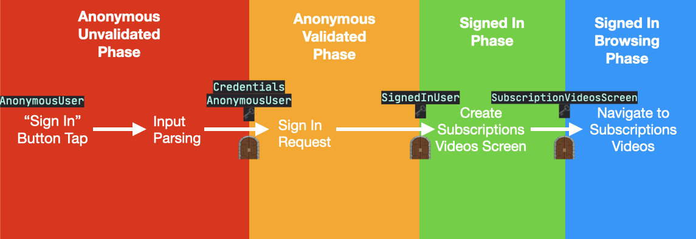

1. What's type-driven design. Type system
1. Using Types to model requirements
1. Patterns of Data and Function Types
1. Making Partial functions Total
1. Making Impure functions Pure
1. Value-Oriented Programming
1. Functional Dependency Injection
1. Modeling Async actions
1. Advanced Type Safety tricks
1. Why should we care?

## What's type-driven design. Type system

## Using Types to model requirements

Let's consider a simplified software development cycle from Engineer's perspective:

1. Analyse requirements
1. Write code
1. Deploy a build
1. Repeat

In an ideal world a sufficient number of such cycles would produce software that fully and precisely meets 
all the requirements, and contains zero defects. The real world, however, is a cruel place where dreams come to die.

Let's see what can, and often does, go wrong:

1. Analyse requirements. *But interpret them incorrectly.*
1. Write code. *But based on incorrectly interpreted requirements. Or make mistakes when implementing correctly interpreted requirements*.
1. Deploy a build. *That contains defects*.
1. Repeat. *Accumulating defects*.

Naturally, such a cycle wouldn't be sustainable and would quickly lead the development to a grinding halt until the backlog of defects is cleared. The common response would be to introduce a new step into the cycle: 

1. Analyse requirements
1. Write code
1. **Write tests**
1. Deploy a build
1. Repeat

But of course, the real world flashes it's Cheshire grin:

1. Analyse requirements
1. Write code
1. **Write tests.** ***But based on same wrong assumptions that were made when writing code.***
1. Deploy a build. *That still contains defects*.
1. Repeat

Ok, we all know that having engineers writing both code and tests based on the code isn't very helpful if both the code and tests have the same incorrect assumptions about actual requirements.

 So, the natural response would be to introduce a new team member that is independent from and is unaffected by the code: **the QA**. But this significantly complicates our software development cycle. In fact, it introduces an altogether new parallel cycle since we don't want Engineers to idle:

1. Analyse requirements
1. Write code
1. Write and run tests
1. Deploy a build
   1. Test the build
   1. Report defects
   1. Repeat
1. Repeat

**Disclaimer:** this is not an article on Project Management, so please don't focus on the accuracy of the process. 
The goal of this article is to show how to **empower Engineers** to produce higher quality results without the introduction of new roles or processes outside of Engineer's `Analyse->Code->Deploy` cycle. Real projects would employ all sorts of best practices, including proper Project Management and the QA, but we won't talk about that here.

You've probably guessed from the article's title that the suggested approach would incorporate the Type System. 
Before writing code, let's capture requirements in the Type System:

1. Analyse requirements
1. **Write type signatures**
1. Write code
1. Write tests
1. Deploy a build
1. Repeat

### Use case 

Let's say we are building the "Subscriptions" tab for YouTube mobile app, where user can be Anonymous or Signed-in.


```
GIVEN User has entered email AND password.
  AND Email is valid.
  AND Password is longer than 8 characters.
WHEN User presses “Sign In” Button. 
  AND Sign In request succeeds.
THEN Show Subscriptions video feed.
```

```
GIVEN User has entered email AND password.
  AND Email is valid.
  AND Password is longer than 8 characters.
WHEN User presses “Sign In” Button. 
  AND Sign In request fails.
THEN Show error message.
```

### Step 1

```swift
func signInButtonAction() {
  guard emailTextField.text.isValidEmail && passwordTextField.text.count > 8 else { 
    return
  }

  signIn(email: emailTextField.text, password: passwordTextField.text)
}

func signIn(email: String, password: String) {
  authService.signIn(email: email, password: password) { (isSuccess: Bool) in
    if isSuccess {
      showSubscriptionVideos()
    } else {
      showErrorMessage("Something went wrong")
    }
}
```

### Step 2

```swift
func signInButtonAction() {
  guard let email = Email(emailTextField.text), 
      let password = Password(passwordTextField.text) else { return }
      
  signIn(email: emailTextField.text, password: passwordTextField.text)
}

func signIn(email: Email, password: Password) {
  authService.signIn(email: email, password: password) { (isSuccess: Bool) in
    if isSuccess {
      showSubscriptionVideos()
    } else {
      showErrorMessage("Something went wrong")
    }
  }
}

struct Email {
    let string: String
    
    init?(_ rawString: String) {
        guard rawString.isValidEmail else {
          return nil 
        }
        string = rawString
    }
}

struct Password {
    let string: String

    init?(_ rawString: String) {
        guard rawString.count > 8 else { 
          return nil
        }
        string = rawString
    }
}

struct Credentials {
    let email: Email
    let password: Password
}
```

### Step 3

```swift
func signInButtonAction() {
  guard let email = Email(emailTextField.text), 
      let password = Password(passwordTextField.text) else { return }
      
  signIn(credentials: Credentials(email: email, password: password))
}

func signIn(credentials: Credentials) {
  authService.signIn(credentials: credentials) { ... }
}

struct Email { ... }
struct Password { ... }

struct Credentials {
    let email: Email
    let password: Password
}

```

[Robert Harper - Boolean Blindness](https://existentialtype.wordpress.com/2011/03/15/boolean-blindness/)

```swift
func signInButtonAction() { ... }

func signIn(credentials: Credentials) {
  authService.signIn(credentials: credentials) { (isSuccess: Bool) in //<---What's a bool?
    if isSuccess { 
      showSubscriptionVideos()
    } else {
      showErrorMessage("Something went wrong")
    }
  }
}
```

[David Luposchainsky - Algebraic Blindness](https://github.com/quchen/articles/blob/master/algebraic-blindness.md)

```swift
func signInButtonAction() { ... }

func signIn(credentials: Credentials) {
  authService.signIn(credentials: credentials) { (user: User?) in //<---What's an optional?
    if let user = user {
      self.user = user
      showSubscriptionVideos()
    } else {
      showErrorMessage("Something went wrong")
    }
  }
}

struct User {
    var username: String?
    var userID: String?
    // ... //

    var isAuthenticated: Bool {
        username != nil && token != nil
    }
}
```

```swift
struct AnonymousUser {
    // ... //
}
struct SignedInUser {
    var username: String
    var userID: String

    // ... //
}

enum User {
  case anonymous(AnonymousUser)
  case signedIn(SignedInUser)
}
```

### Before


### After


### After


## Mapping Requirements to Type Signatures

### Success scenario

| Requirements| Type Signatures |
| ------------------------------------------------------------------ | ------------------------------------------ |
| As anonymous user, I want to sign in to see my subscription videos | `User` = `AnonymousUser` OR `SignedInUser` |
| `GIVEN` User has entered email and password                        | `String` AND `String`                      |
| `AND` Email is valid                                               | `Email`                                    |
| `AND` Password is longer than 8 characters                         | `Password`                                 |
| `WHEN ` User presses “Sign In” Button                              | `signIn: (Email, Password) -> Void`        |
| `AND` Sign In succeeds                                             | `SignedInUser`                             |
| `THEN` Show subscription videos                                    | `screen: (SignedInUser) -> SubscriptionVideosScreen` `navigate: (SubscriptionVideosScreen) -> Void` |

### Failure scenario

| Requirements| Type Signatures |
| ------------------------------------------------------------------ | ------------------------------------------ |
| [ *... same as above* ]                                            | [ *... same as above* ]                    |
| `WHEN ` User presses “Sign In” Button                              | [ *... same as above* ]                    |
| `AND` Sign In request fails                                        |  `Error`                                   |
| `THEN` Present error message                                       |  `presentError: (Error) -> Void`           |

### Correspondance between Programming and Formal Logic

| Programming| Formal Logic |
| ------------------------------------------------------------------ | ------------------------------------------ |
| **Types**: `Email`    | **Propositions**: `Email` exist when it follows RFC 5322 address specification. |
| **Value**: `let email = Email()`    | **Proofs**: We have a material proof that this Email is valid! |
| **Function Types**:`(SignedInUser) -> SubscriptionVideosScreen`    | **Inference (consequence)**: IF `SignedInUser` THEN `SubscriptionVideosScreen`, *If user is signed in then we can create the screen with subscription videos.* |
| **Combination (Product) type**: `struct Credentials { let email: Email, let password: Password }` | **AND (conjunction)** `Credentials` is `Email` AND `Password` |
| **Choice (Sum) types**: `enum User { case anonymous(AnonymousUser) case signedIn(SignedInUser) }` | **OR (disjunction)** `User` is `AnonymousUser` AND `SignedInUser` |

